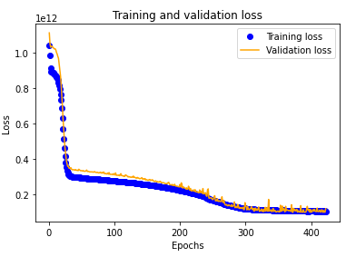

### Team Members:

- Halley Ngoc Pham
- Yan Shao
- Carl Gonzales
- Mark Stephen

# Project-4-Car Price Prediction with Data Visualisation

(Presentation Link: https://docs.google.com/presentation/d/1Ya0yGKNYAjsOq62d1hfO2kxdjxXGcxzO9eEkBvXzA7Q/edit#slide=id.g1fefbfaf6d9_0_50)

**_Table of Contents:_**

1. [Purpose of the assignment](#purpose-of-the-assignment)
1. [Data Source](#data-source)
1. [Process of the project](#process-of-the-project)
1. [Conclusion](#conclusion)

 

### Purpose of the assignment

    The aim of our project is to explore and predict the used car price based on the model that we use the machine learning model to train based on the existing data. We’ll examine difference between the actual price and the predicted price.

    This will involve retrieving existing car price from Kaggle website.

 

### Data source:

    https://www.kaggle.com/datasets/nehalbirla/vehicle-dataset-from-cardekho?datasetId=33080&sortBy=dateCreated

 

### **Process of the project**

1. Data Import and Data Preprocessing

   1. Import data from our github link 'https://raw.githubusercontent.com/Alphaomegainfinity/Project-4_Car_Price_Predictor/main/Resources/Car%20details%20v3.csv'and retrieve the dataset
   1. Data cleaning: dropping the columns and convert column type
   1. Data Visualisation : Visualise the coalation between all catergorical columns, ie
      engine type or km driven.
      
   1. Data transformation : using getting dummies to transform the dataset.

1. Compile, Train the Model :

   1. Split our preprocessed data into our features and target arrays
   1. check the best linear regression model which has the best score for training and testing. As it is shown below:
      
      We can conclude that ExtraTree Regressor has the best traning and testing score.
   1. Therefore, we imported RandomizedSearchCV to cross-validate the model by checking the predicted value against the actual value.
      
   1. We tried to use the deep machine learning to explore if we could get a more accurate model.
      Here is our best training and validation accuracy plot:
      

1. Evaluation the model:

   we adjust the data to feed into our deep learning model to see which combinations of data gave us the most accurate line between our training and testing datasets.

### Conclusion:

In conclusion we found that the pre-trained models from the SKlearn libraries were quite accurate with our dataset once it was properly cleaned and scaled.

In our own attempts to make a regression deep learning neural network we found that the loss was quite significant to begin with but was trending down. We believe that with further modification to the neural network to dial in the accuracy we would be able to get a model that performed as well as the pre-trained models.
Further to this we believe that with sufficient data for your chosen market you can accurately predict the value of a used vehicle by using a regression method. It is worth noting that this method will not account for current fluctuations in your chosen market.
